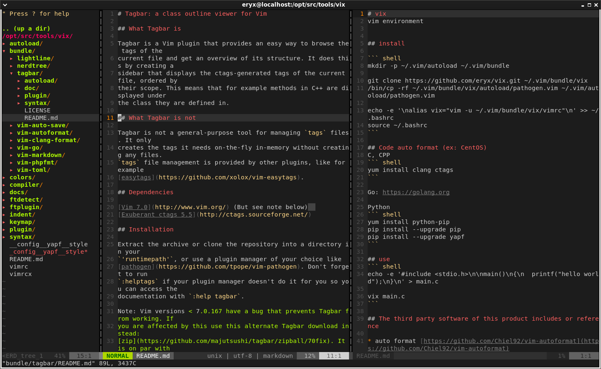

# vix
vim environment


## install

``` shell
mkdir -p ~/.vim/autoload ~/.vim/bundle

git clone https://github.com/eryx/vix.git ~/.vim/bundle/vix
/bin/cp -rf ~/.vim/bundle/vix/autoload/pathogen.vim ~/.vim/autoload/pathogen.vim

echo -e '\nalias vix="vim -u ~/.vim/bundle/vix/vimrc"\n' >> ~/.bashrc
source ~/.bashrc
```

## Code auto format (ex: CentOS)
C, CPP
``` shell
yum install clang ctags
```

Go
``` shell
# EPEL Required (https://fedoraproject.org/wiki/EPEL)
yum install golang
```

Python
``` shell
yum install python-pip
pip install --upgrade pip
pip install --upgrade yapf
```

rust
``` shell
rustup component add rustfmt
```

## use
``` shell
echo -e '#include <stdio.h>\n\nmain()\n{\n  printf("hello world");\n}\n' > main.c

vix main.c
```

## Screenshot of UI




## The third party software of this product includes or reference

* auto format [https://github.com/vim-autoformat/vim-autoformat](https://github.com/vim-autoformat/vim-autoformat)
* auto save [https://github.com/907th/vim-auto-save](https://github.com/907th/vim-auto-save)
* clang-format [https://github.com/rhysd/vim-clang-format](https://github.com/rhysd/vim-clang-format)
* ft-go [https://github.com/google/vim-ft-go](https://github.com/google/vim-ft-go)
* lightline [https://github.com/itchyny/lightline.vim](https://github.com/itchyny/lightline.vim)
* molokai scheme [https://github.com/tomasr/molokai](https://github.com/tomasr/molokai)
* nerd tree [https://github.com/scrooloose/nerdtree](https://github.com/scrooloose/nerdtree)
* pathogen.vim [https://github.com/tpope/vim-pathogen](https://github.com/tpope/vim-pathogen)
* protobuf.vim [https://github.com/google/protobuf/blob/master/editors/proto.vim](https://github.com/google/protobuf/blob/master/editors/proto.vim)
* rust.vim [https://github.com/rust-lang/rust.vim](https://github.com/rust-lang/rust.vim)
* tagbar [https://github.com/majutsushi/tagbar](https://github.com/majutsushi/tagbar)
* vimagic [https://github.com/jreybert/vimagit](https://github.com/jreybert/vimagit)
* vim-go [https://github.com/fatih/vim-go](https://github.com/fatih/vim-go)
* vim-markdown [https://github.com/plasticboy/vim-markdown](https://github.com/plasticboy/vim-markdown)
* vim-phpfmt [https://github.com/Bubujka/vim-phpfmt](https://github.com/Bubujka/vim-phpfmt)
* vim-toml [https://github.com/cespare/vim-toml](https://github.com/cespare/vim-toml)
